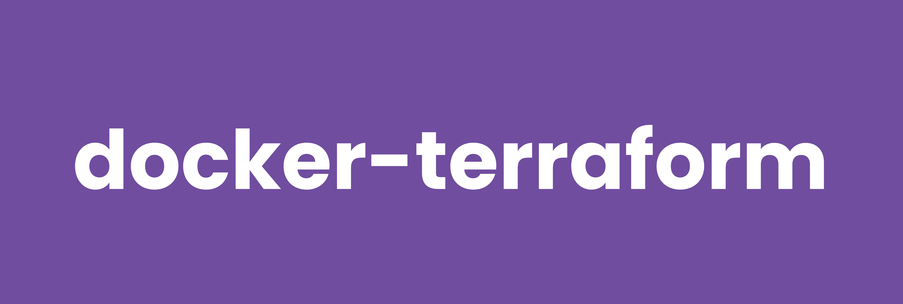

# docker-terraform



[](https://github.com/RagedUnicorn/docker-terraform/actions/workflows/docker_release.yml)
[](https://github.com/RagedUnicorn/docker-terraform/actions/workflows/test.yml)


> Docker Alpine image with the Terraform CLI for infrastructure as code.


## Overview

This Docker image provides a minimal Terraform CLI installation on Alpine Linux.
It downloads the official Terraform release from HashiCorp and **cryptographically
verifies it** (GPG signature on the checksums, then the checksum of the binary)
before it is ever placed into the runtime image. The result is a small,
non-root, fully OCI-labelled image with `terraform` as its entrypoint.

## Features

- **Small footprint**: minimal runtime image using Alpine Linux
- **Verified download**: GPG signature and SHA256 checksum are verified at build time
- **Single purpose**: `terraform` is the entrypoint - nothing else bundled
- **Non-root user**: runs as the unprivileged `terraform` user
- **Multi-architecture**: supports `linux/amd64` and `linux/arm64`
- **git + openssh + ca-certificates**: included for module sources and registry/backend HTTPS

## Quick Start

```bash
# Pull the image
docker pull ragedunicorn/terraform:latest

# Show the version
docker run --rm ragedunicorn/terraform:latest version

# Run against a configuration in the current directory
docker run --rm -v "$(pwd)":/workspace ragedunicorn/terraform:latest init
docker run --rm -v "$(pwd)":/workspace ragedunicorn/terraform:latest plan
```

For development and building from source, see [DEVELOPMENT.md](DEVELOPMENT.md).

## Usage

The container uses Terraform as the entrypoint, so any Terraform subcommand and
its flags can be passed directly to the `docker run` command. Each subcommand is
a separate invocation.

### Basic Usage

```bash
# Using latest version
docker run --rm -v "$(pwd)":/workspace ragedunicorn/terraform:latest [terraform-args]

# Using a specific Terraform version
docker run --rm -v "$(pwd)":/workspace ragedunicorn/terraform:1.9.8 [terraform-args]

# Using an exact version combination
docker run --rm -v "$(pwd)":/workspace ragedunicorn/terraform:1.9.8-alpine3.22.1-1 [terraform-args]
```

### Examples

```bash
# Initialize a working directory
docker run --rm -v "$(pwd)":/workspace ragedunicorn/terraform:latest init

# Create an execution plan
docker run --rm -v "$(pwd)":/workspace ragedunicorn/terraform:latest plan

# Apply changes
docker run --rm -v "$(pwd)":/workspace ragedunicorn/terraform:latest apply

# Format configuration files
docker run --rm -v "$(pwd)":/workspace ragedunicorn/terraform:latest fmt

# Validate configuration
docker run --rm -v "$(pwd)":/workspace ragedunicorn/terraform:latest validate
```

## Runtime Notes

Terraform writes state and downloads providers, so it has a few requirements
that read-only linting images do not. Keep these in mind:

### The working directory must be writable

Terraform writes `terraform.tfstate`, `.terraform.lock.hcl` and `.terraform/`
into the working directory. **Do not** mount `/workspace` read-only - it breaks
`init`/`apply`:

```bash
# Correct: writable mount
docker run --rm -v "$(pwd)":/workspace ragedunicorn/terraform:latest init
```

### Match the host user for bind-mount ownership

The image runs as the non-root `terraform` user. A host bind mount keeps host
ownership, which can cause permission errors and leave root-owned files behind.
Run the container as your own user so generated files stay owned by you:

```bash
docker run --rm --user "$(id -u):$(id -g)" \
  -v "$(pwd)":/workspace ragedunicorn/terraform:latest init
```

In Docker Compose, match the host UID/GID:

```yaml
user: "${UID:-1000}:${GID:-1000}"
```

### Persist the provider cache

`terraform init` downloads provider plugins (often hundreds of MB). Mount a
volume and set `TF_PLUGIN_CACHE_DIR` so plugins survive across runs:

```bash
docker run --rm \
  -v "$(pwd)":/workspace \
  -v terraform-plugin-cache:/home/terraform/.terraform.d/plugin-cache \
  -e TF_PLUGIN_CACHE_DIR=/home/terraform/.terraform.d/plugin-cache \
  ragedunicorn/terraform:latest init
```

### Provide credentials via env or mount, never baked in

```bash
docker run --rm \
  -e AWS_ACCESS_KEY_ID -e AWS_SECRET_ACCESS_KEY -e AWS_REGION \
  -v "$(pwd)":/workspace ragedunicorn/terraform:latest apply
```

## Docker Compose Usage

This repository includes Docker Compose configurations for common workflows.

### Basic Setup

```bash
# Run subcommands one at a time (each is a separate invocation)
docker compose run --rm terraform init
docker compose run --rm terraform plan
docker compose run --rm terraform apply
```

The base `docker-compose.yml` mounts the current directory (writable) at
`/workspace` and matches your host UID/GID. Export `UID`/`GID` first so they are
available to compose:

```bash
export UID GID
docker compose run --rm terraform init
```

### Example Configuration

The `examples/` directory contains a runnable workflow example with a persistent
provider cache and credential passthrough:

```bash
docker compose -f examples/docker-compose.yml run --rm terraform init
docker compose -f examples/docker-compose.yml run --rm terraform plan
```

### Environment Variables

- `TERRAFORM_VERSION`: image tag to use (default: `latest`)
- `UID` / `GID`: host user/group IDs for bind-mount ownership
- `TF_PLUGIN_CACHE_DIR`: provider plugin cache directory (see above)

## Building Custom Images

To create a custom image - for example a toolbox that adds extra tooling - start
from this image. Note that adding more tools moves away from the single-purpose
design; a toolbox is better kept in its own repository.

```dockerfile
FROM ragedunicorn/terraform:latest

USER root
RUN apk add --no-cache --update aws-cli
USER terraform

WORKDIR /workspace
```

## Versioning

This project uses versioning that matches the Docker image contents:

**Format:** `{terraform_version}-alpine{alpine_version}-{build_number}`

Examples:
- `1.9.8-alpine3.22.1-1` - Terraform 1.9.8 on Alpine 3.22.1, build 1
- `latest` - Most recent stable release

The build number resets to `1` whenever Terraform is bumped, and is incremented
only for rebuilds that leave the Terraform version unchanged (an Alpine patch or
base CVE fix). For the detailed release process, see [RELEASE.md](RELEASE.md).

## Automated Dependency Updates

This project uses [Renovate](https://docs.renovatebot.com/) to automatically
check for updates to:
- Alpine Linux base image version
- Terraform version (tracked via the GitHub releases datasource)

Renovate runs weekly and creates pull requests when updates are available.

## License

This repository - the Dockerfile, scripts and documentation - is licensed under
the **MIT License**.

The bundled **Terraform binary is not MIT**. Terraform is distributed by
HashiCorp under the **Business Source License 1.1 (BSL-1.1)**, which is
source-available but not an OSI-approved open source license. See HashiCorp's
[LICENSE](https://github.com/hashicorp/terraform/blob/main/LICENSE) for the
terms governing the binary.

If you need a fully open source alternative, swap the download in the Dockerfile
for [OpenTofu](https://github.com/opentofu/opentofu) (MPL-2.0); everything else
in this repository applies unchanged.

## Documentation

- [Development Guide](DEVELOPMENT.md) - Building, debugging, and contributing
- [Testing Guide](TEST.md) - Running and writing tests
- [Release Process](RELEASE.md) - Creating releases and versioning

## Links

- [Terraform Documentation](https://developer.hashicorp.com/terraform/docs)
- [Terraform Releases](https://releases.hashicorp.com/terraform/)
- [OpenTofu](https://opentofu.org/) - open source alternative
- [Alpine Linux](https://www.alpinelinux.org/)
